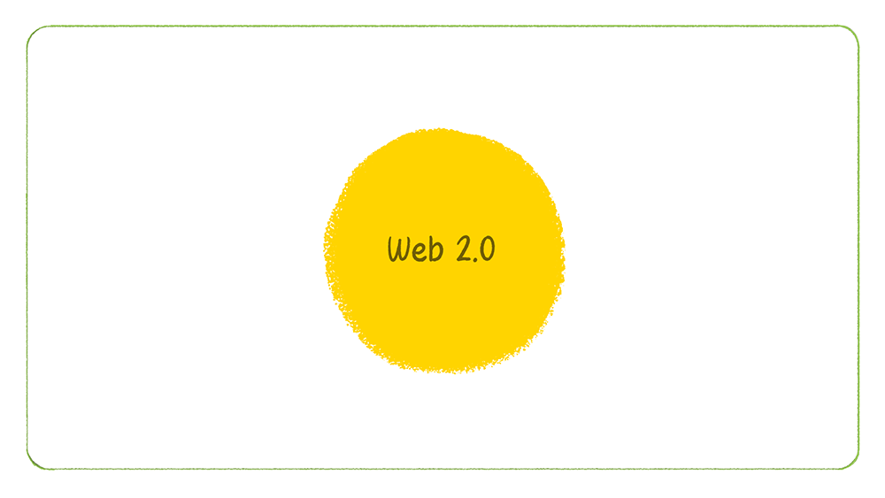

## Pitch

    
     
    <i>Figure 1 - Web 2.0</i>

    
     
    <i>Figure 2 - From Web 2.0 Evolved Web 3.0...</i>

    
     
    <i>Figure 3 - Seeking to Disrupt...</i>

    
     
    <i>Figure 4 - What If We Now Seek Less Disruption and More Collaboration...</i>

    
     
    <i>Figure 5 - ...Simply and Securely Reconciling the Best of Web 2.0 With the Best of Web 3.0?</i>

<!-- In the pitch, discuss token centralization, ID and collusion as risks to the integrity of DAOs, and then explain how the idea mitigates those risks using mechanisms already in place within most existing organizations and workplaces. -->

<!-- End the pitch by saying that I'm currently seeking input on possible next steps regarding the proposal -->

 
<table>
    <tr>
        <th align="center">
            
            
<a href="../README.md"><—&nbsp;&nbsp;Description</a>

        </th>
        <th align="center">
            
            
<a href="./SolutionApproach.md">Solution Approach&nbsp;&nbsp;—></a>

        </th>
    </tr>
</table>
